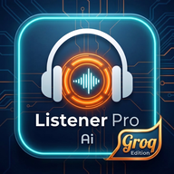

<div align="center">



# LISTENER PRO

### Speak. AI listens. AI responds. Repeat.

**Your real-time AI co-pilot for the conversations that matter.**
Live whispered coaching while you talk — or a full AI session on demand.

[**⚡ Launch the App**](https://johnlaz.github.io/listener/app/) &nbsp;·&nbsp; [**🌐 Visit the Site**](https://johnlaz.github.io/listener/) &nbsp;·&nbsp; [**🤖 Download the APK**](https://johnlaz.github.io/listener/app/lpai.apk)


</div>

---

## Some conversations are too important to wing.

A tense talk with someone you love. A sales call with real money on the line. A coaching session where you need to find the right words *right now*.

Listener Pro sits quietly in your corner. It hears the conversation, thinks at the speed of Groq, and gives you exactly one thing: the next best thing to say.

No scripts to memorize. No tabs to switch. Just a calm voice in your ear.

---

## Two ways to use it

### 👂 Whisper Mode — a coach in your ear
Listener Pro follows a live conversation and whispers cues back to you, in the style you choose:

| | Style | What you get |
|---|---|---|
| 💚 | **Supportive** | Short, validating phrases — *"I hear you."* *"That makes sense."* |
| 💛 | **Engaged** | One curious follow-up question, every turn |
| ❤️ | **Logical** | A calm, objective counter-point |
| 💙 | **Baseline** | De-escalation and mediation language when things heat up |

### 🧠 Session Mode — think out loud with a partner
Talk directly to an AI that actually plays a role:

| | Persona | Best for |
|---|---|---|
| 🧠 | **Therapist** | CBT-informed reflective listening |
| 💼 | **Sales Coach** | Roleplay a prospect, or get coached on your pitch |
| 🪞 | **Devil's Advocate** | Stress-testing ideas before the world does |
| 🧭 | **Life Coach** | Goals, obstacles, and concrete next steps |

---

## Built for speed

```
🎙 Mic  →  VAD  →  Groq Whisper  →  Groq LLM (streaming)  →  🔊 Voice
```

Groq's inference is fast enough that the conversation never has to wait. Words stream onto your screen as they're generated, and the AI never hears its own voice — listening pauses automatically while it speaks.

---

## Always on the newest models

Groq ships new models constantly. Listener Pro keeps up **without an update**: save your key and the app pulls the latest chat models available to *your* account, drops the non-chat ones, and lets you pick from a dropdown in Settings. The list refreshes itself in the background. If a model is ever retired, the app notices and switches over.

---

## Everything else you'd want

- 🎯 **Tunable voice detection** — dial the silence threshold from 400 ms to 2 s
- 🔊 **Your choice of voice** — any voice your device offers
- 📋 **Session history** with AI-written summaries, personal notes, and lock-to-protect
- 💼 **Sales templates** — build a prospect profile, or auto-fill it from a company URL
- 👁 **Ghost Mode** — a blank, discreet screen with tap-corner controls
- 📦 **Backup & restore** everything as a single JSON file
- 🔌 **Works offline** as an installed app

---

## 🔒 Private by design

- **No account. No cloud. No subscription.** Bring your own free Groq key.
- Your key and every session live **only on your device**.
- The only place your data ever goes is straight to Groq.
- No analytics. No tracking. No backend.

---

## Get started in 60 seconds

1. Grab a free API key at [console.groq.com](https://console.groq.com)
2. Open **[johnlaz.github.io/listener/app](https://johnlaz.github.io/listener/app/)**
3. Paste your key. Hit **Initialize**. Start talking.

**Install it:** tap *Share → Add to Home Screen* on iOS, the install banner on Android, or the install icon in your desktop browser's address bar. Prefer a native feel on Android? [Grab the APK](https://johnlaz.github.io/listener/app/lpai.apk).

---

## Repo layout

```
/            Landing page
/app/        The app — index.html, manifest.json, sw.js, icons, APK
```

Technical docs, self-hosting, and the full file list live in [`app/README.md`](./app/README.md).

---

<div align="center">

**Made by [LAZLAB Creations](https://johnlaz.github.io/)** &nbsp;·&nbsp; MIT licensed

</div>
