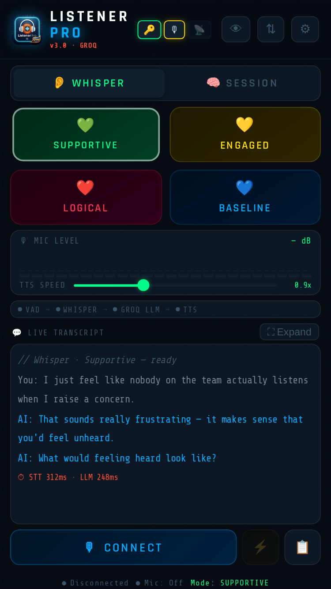

<div align="center">


# Listener Pro AI &nbsp;·&nbsp; v3.0 Groq Edition

**Speak. AI listens. AI responds. Repeat.**

[Launch](https://johnlaz.github.io/listener/app/) &nbsp;·&nbsp; [Site](https://johnlaz.github.io/listener/) &nbsp;·&nbsp; [Android APK](./lpai.apk)

</div>

---

## What it is

Listener Pro is a single-file progressive web app that turns your microphone into a real-time AI co-pilot. Bring your own free Groq key and you get live conversational coaching, persona sessions, and spoken replies — with no account, no backend, and nothing leaving your device except calls to Groq.

> 👂 **Whisper Mode** coaches you *during* a live conversation.
> 🧠 **Session Mode** lets you talk *with* an AI persona.



---

## The pipeline

```
Mic → VAD → Groq Whisper STT → Groq LLM (streaming) → Web Speech TTS
```

| Stage | What happens |
|---|---|
| **VAD** | Detects when you stop speaking and sends automatically. Silence threshold is adjustable from 400 ms to 2000 ms. |
| **Groq Whisper** | Transcribes your speech — typically in ~200–400 ms. |
| **Groq LLM** | Streams the reply token by token, using the model you choose. |
| **Web Speech TTS** | Speaks it back. VAD is fully gated while the AI talks, so it can never hear itself. |
| **⚡ Manual override** | Force a reply any time. |

---

## Modes & personas

### 👂 Whisper Mode
| | Style | Output |
|---|---|---|
| 💚 | Supportive | Short validating phrases |
| 💛 | Engaged | One curious follow-up question per turn |
| ❤️ | Logical | Calm, objective counter-point |
| 💙 | Baseline | De-escalation and mediation phrases |

### 🧠 Session Mode
| | Persona | Focus |
|---|---|---|
| 🧠 | Therapist | CBT-informed reflective listening |
| 💼 | Sales Coach | Prospect roleplay or pitch coaching |
| 🪞 | Devil's Advocate | Stress-tests your thinking |
| 🧭 | Life Coach | Goals, obstacles, action steps |

---

## Models — always current

### 🤖 LLM: pulled live from your key

There is no hardcoded model list to go stale. When you save your key (or tap **↻ Refresh** in Settings → LLM Model), the app asks Groq which models your account can use, then:

- keeps **chat models only** — speech, TTS, guard/safety, embedding, and compound-agent models are filtered out
- shows the **newest five** in a dropdown, plus your current pick if it has slipped off the list
- chooses a sensible **default** (the largest non-reasoning model) the first time
- **refreshes silently** in the background when the list is more than 3 days old
- **self-heals**: if Groq reports the selected model as retired, the app re-pulls the list and retries once on a replacement

Reasoning models (e.g. `gpt-oss`, `qwen3`) are always selectable but never auto-picked — Listener Pro streams short real-time replies, where hidden reasoning tokens add latency.

If Groq can't be reached, the app keeps using your last saved model, falling back to `llama-3.3-70b-versatile` on a fresh install.

### 🎙 STT: set in Settings

| Model | Notes |
|---|---|
| `whisper-large-v3` | Highest accuracy — recommended |
| `whisper-large-v3-turbo` | ~2× faster, minimal accuracy trade-off |

---

## Features

- 🎯 **Adjustable VAD** — 400 ms to 2000 ms silence threshold
- 🔊 **Voice selector** — any browser voice, with a test button
- 💬 **Streaming replies** — words appear as they're generated
- 📊 **Live pipeline timing** — watch STT and LLM latency
- 📋 **Session history** — auto-saved with AI-generated summaries
- 🔒 **Lock sessions** — protect the important ones from deletion
- 📝 **Session notes** — attach your own notes to any session
- 📤 **Export** — transcripts and summaries as `.txt`
- 💼 **Sales templates** — save prospect profiles, auto-fill from a company URL
- 👁 **Ghost Mode** — blank screen with tap-to-change-mode corners
- 📦 **Import / Export** — back up and restore everything as JSON
- 🔌 **Offline-capable** — app shell cached by a service worker

---

## Setup

### 1 · Get a Groq key
Free at [console.groq.com](https://console.groq.com). Keys start with `gsk_`.

### 2 · Run it

**Hosted (easiest)** — open [johnlaz.github.io/listener/app](https://johnlaz.github.io/listener/app/), paste your key, go.

**Self-host on GitHub Pages**
1. Fork or clone the repo
2. **Settings → Pages → Deploy from branch → `main` / root**
3. Open `https://<you>.github.io/<repo>/app/`

**Run locally**
```bash
# from the repo root
npx serve .
# or
python3 -m http.server 8080
```
Then open `http://localhost:8080/app/`.

> ⚠️ Microphone access needs HTTPS (or `localhost`). GitHub Pages provides HTTPS automatically.

### 3 · Install it
- **iOS** — Share → Add to Home Screen
- **Android / Chrome** — the install banner, or the [APK](./lpai.apk)
- **Desktop** — the install icon in the address bar

---

## Repo structure

```
/
├── index.html                 # Landing page
├── README.md
└── app/
    ├── index.html             # The whole app (single file)
    ├── manifest.json          # PWA manifest (scope: /listener/app/)
    ├── sw.js                  # Service worker
    ├── lpai.apk               # Android build
    ├── favicon.ico · favicon-16x16.png · favicon-32x32.png
    ├── apple-touch-icon.png   # iOS home-screen icon (180×180)
    ├── icon-72 … icon-512.png # Standard PWA icons
    ├── icon-512x512-maskable.png
    └── screenshot-wide.png · screenshot-narrow.png
```

---

## 🔒 Privacy

- Your Groq key is stored in `localStorage` and sent **only** to `api.groq.com`
- Audio is captured by your browser's microphone APIs and sent only to Groq for transcription
- Session history lives in `localStorage` on your device
- No analytics, no tracking, no backend

---

## License

MIT — use it freely, change it freely.

<div align="center">

**Made by [LAZLAB Creations](https://johnlaz.github.io/)**

</div>
